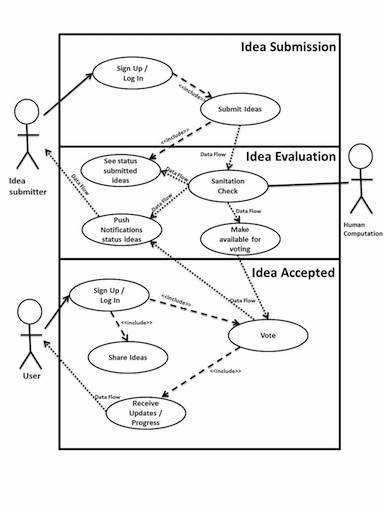
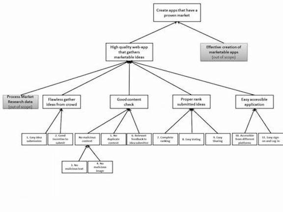
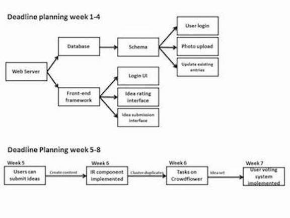

##Project Idea Document - Group 2
####Pitch/Introduction
Ever had a GREAT application idea? A lot of us have had an idea for the next Facebook or Twitter, when you wake up, are traveling or even in late night sessions. But you did not have the time, money or expertise to grow this idea to its full potential. We have the solution for you: get it Sparked! The idea is all about ideas and provides the user opportunities to obtain some financial gains from their brilliant ideas, even though they have no proficiency in programming. 

Interestingly, it is a market research tool at the same time, as it tracks and ranks the submitted ideas based on popularity. Prototypes of the best ranked ideas will be developed and pitched to potential buyers or investors. Sparked will be an application that uses Crowdsourcing, Human Computation and Information Retrieval to find the gems among the vast amount of ideas that users come up with. The focus during this course will be the first parts of the application; starting from the idea submission to the ranking of the ideas. The business part of Sparked will not be developed during the coming weeks.

####Relevance to Course
In order for any project to be relevant to the course, the three main components of the course should be applicable within the project: crowdsourcing, information retrieval, and human computation. For Sparked, all three elements can be found. First crowdsourcing will be discussed, then human computation, and last information retrieval.

#####Crowdsourcing
Sparked uses crowdsourcing in three different ways. The first way the crowd is called upon is for content generation. All ideas submitted to Spark have been created by the crowd. The second way we utilize the crowd is during the voting phase. The crowd can vote for ideas, creating a popularity ranking of ideas. Thus, the crowd decides which idea should be developed. Lastly, advertisement and sharing is done by the crowd. Individuals can share their idea with the crowd and the crowd can then spread the idea. By directly linking to Sparked, any idea that is shared is advertisement for Sparked.

#####Information Retrieval
Retrieving and comparing texts is part of information retrieval. Within Sparked, this is used to check the similarity between new ideas and existing ideas. The results of the automated similarity check will be a set of ideas with high similarity to the idea being checked. These results are then verified by humans. The check does not have to be very fast. The more accurate the automated similarity checking system is, the less human computation will be needed. Possible problems with this is that while ideas are being processed, new ideas are also submitted. This would mean new ideas should also be checked against ideas that are not yet accepted or rejected.

An interesting opportunity that comes with Sparked is sense-making from the idea submissions and how they do in the crowd. Looking at the voting behaviour of the users over time, preferences and trends can be detected. In this era of big data, there is the challenge of gaining valuable insights from the mass of available data.

#####Human Computation
Within Sparked, this is done in two ways during the content check. First, the images and text are checked to see if they do not contain malicious content. Second, human computation is used to check the results of the similarity check. Both these tasks can be done automatically to some degree. For the checking for malicious content you could use the results from the human computation as a training set for a Pattern Recognition system to automatically label malicious content. And the similarity check is only necessary if the automated part gives uncertain results. Human Computation is important to guarantee the quality of the content that is accepted by the system. 

####Innovative and Challenging Nature of Project
#####Innovativeness
These days there are a lot of platforms that help people make their idea a reality. You can use crowdfunding to raise funds on sites such as Kickstarter and Indiegogo. And you can hire freelancers to develop your idea on platforms like oDesk, Elance etc. However, running a Kickstarter campaign and coordinating a project is still very labour intensive. Do you have the time, skills, drive to work on your idea? Is your idea even any good? Will it resonate with people? Sparked is the first ever platform where submitting your idea is all the effort needed to potentially make your idea a money-making reality. Anyone can join. By leveraging the power of the crowd we aim to facilitate the creation of apps that have a proven market.

#####Challenges
There are several challenges in realizing our project. One of them is participation. For our project to be successful, we rely very much on the crowd participating in submitting ideas and voting for ideas. The incentive for a user to submit an idea will be the possibility to see the idea produced and sold, making money by receiving a percentage of the revenue the product generates. People get excited when they get an idea and want to share it, and get a response. Submitting an idea to our platform will give users the opportunity to see how their idea resonates with the crowd. Voting for ideas can be fun as well, as the user comes across a wide variety of ideas; unique, silly, useful or the exact opposite. We want our platform to have a sense of fun, dreams and endless possibilities. 

There are several techniques we will implement to make participation in each step of the process as simple as possible. The users can login to our platform using a FaceBook login. Facebook is used ubiquitously. Through FaceBook, the user can easily share his or her idea with his or her friends, which will help in leading more people to our platform. We use responsive web design so that the platform is easily accessible from any device: pc, smartphone etc. For the voting process, we use a Tinder-like design, with users swiping right to up-vote and left not to up-vote. This design is easy to use and recognizable for a lot of people. The user who submitted an idea can see how well his idea is doing in the rankings, which will motivate the user to invite more people to vote on his idea. Another way to engage our user base could be to send weekly updates via email giving a personalized update on number of new ideas the user hasn't voted on yet and the ranking(s) of the idea(s) submitted by the user.

Another challenge for our project is implementation. The project is made up of different components that have to work together seamlessly. We need to implement Facebook connectivity, a CrowdFlower pipeline, Database access using mySQL and compatibility with Dandelion, all while having our responsive website for the platform built using PHP and CSS as a base. Most of this will be invisible to the user, but integral to the functioning of the platform. We want to compare ideas for similarity using text analysis, to avoid multiple instances of the same idea. This can be difficult, because subtle differences in text can give widely different semantic meanings.

####Objectives
The goal of Sparked is to be able to create apps that have a proven market. This can be divided into two sub-goals: 

1. High quality web-app that gathers marketable ideas 
2. Effecctive creation of marketable apps

In the short timespan of the Information Retrieval course, it will not be possible to implement all the components. Therefor the decision has been made to focus only on the first sub-goal. This sub-goal has been worked out into 11 different requirements in a goal-tree (see appendix 1). 

####Requirements and Specifications
#####User Characteristics
The application has a wide possible user base, including both experienced and non-experienced users.The general users that the application addresses are listed below:
* Non-experienced User:	Average people with little or no expertise, time, or money. Uses the system to share ideas and/or vote on ideas.
* Experienced User:	Individual with expertise in a specific field, who uses the system to take the ideas to the implementation level. They can be in-house experts who define the chosen ideas or developers hired by Sparked to create an application. They can also vote on ideas in our platform.
* Investors/Companies:	Users who are looking for new ideas to get implemented and gain profit by funding and/or providing resources for it. They can also vote on ideas that they would like to get implemented.	

#####Functional Requirements
The application functions in two phases; one for sharing and voting ideas and another for working on the implementation of the ideas. The main functional requirements in these phases are as follows:

The text is structured as followed, the headers are the subobjectives of the application. The bullets depict the objective number between brackets with the corresponding requirement in text. These objective numbers can be found in appendix 1.

######Easy accessible application
*	(11) The system allows users to sign in using Facebook
*	(10) The system will be a web application that also runs on mobile devices

######Flawless gathering of ideas from the crowd
*	(1) The user can submit ideas via mobile devices or a computer
*	(1) The user can submit ideas via Facebook
*	(1) The user can submit text with a maximum of 140 characters
*	(1) The user can optionally submit a picture
*	(2) The submitter gets a 5% from the revenue generated from the idea
*	(2) The submitter is notified on state changes of his idea
*	(2) The submitter can keep track of the ranking of his idea

######Good content check
*	(3) The system must do a content check for malicious content on the text
*	(4) The system must do a content check for malicious content on the picture
*	(5) The system must execute an automated similarity check on the text
*	(5) The results of the IR query are then double checked in a human computation system
*	(6) The system must give a notification informing the user of the status of their submission
*	(6) The system must notify the user if an idea is accepted. The idea is sent to the public idea pool
*	(6) The system must notify the user if an idea is rejected. If it is rejected, a reason must be provided to the user
	
######Proper ranking by marketability of submitted ideas
*	(7) The system must allow all users to see the ideas in the public idea pool and rank them
*	(7) Each person can only vote for an idea once
*	(8) Voting should be frictionless
*	(8) Ideas can be ranked by voting or liking them on facebook
*	(9) Ideas can be shared on Facebook

######Extra specifications without linked objective
*	The voter cannot see the rank of the idea he voted for
*	The voter can browse through ideas that he or she voted for
* The system ranks all ideas according to the number of likes they receive
*	The language of the application, as well as the ideas, is English only

####Execution Plan

#####Summary of work so far
The first aspect of the project we put a lot of time into was designing and defining our idea. It took a lot of conversation to really nail down what we wanted to do. 

The second thing we have spent a lot of time in is setting up the development environment. We set up an Amazon web server running AMI. There is a basic LAMP (linux, apache, mysql, and php) stack running on it. We also have phpmyadmin running on the server which will make it much easier to manage our database. We have looked into different web application templates we will be able to leverage to speed our development but have not chosen one yet.

See appendix 2 for our diagram of the execution plan

#####Week 4 goals
This week, it will be critical to build a database schema. The schema is necessary for almost the whole rest of the application to be developed. We also need to select what libraries or templates we are going to be developing with. 

#####Week 5 goals
By week 5, we want users to be able to log into the system and submit ideas (both photo and text). This will require database connectivity to the front end. It will also require a technology to make it easy to upload photos taken on a mobile devide to be uploaded to our web application.

#####Week 6 goals
By the end of week 6, we would like to have implemented out information retrieval system. This system needs to be able to find idea duplicates. We also want to set up our tasks on crowdflower and complete the tasks internally. This means we will not pay for the crowdflower service but will still learn how the system works.

#####Week 7 goals
During this week, we want to implement a user voting system. This means that users should be able to log in and view the ideas that are in the public pool. When viewing the ideas, the user should be able to upvote the ideas he or she likes.

#####Week 8 goals
Finalize front end, prepare for the final presentation and wrap up any remaining tasks!

####UML Design

####Evaluation and Success Metrics
#####IR system evaluation
The IR system will be used to find similar ideas in the idea pool. The purpose of this is to keep duplicate ideas from being submitted. This part of the application can be evaluated to see if the system correctly clusters similar ideas. The evaluation metrics that will be used for this are Precision and Recall:

                             Precision: True Positives / (True Positives + False Positives)
                             Recall:    True Positives / (True Positives + False Negatives)

Each new idea will be compared to all the ideas that have been accepted. An idea is deemed too similar when a certain threshold is surpassed and will then be checked by a human. The precision measure in this case would denote how many ideas that were classified as similar are defined by a human computer to actually be similar. Recall would denote how many similar ideas from the pool of accepted ideas are recognized by the similarity check as similar. A false negative would be an idea from the pool that is similar but was not recognized as such.

#####Human Computation Evaluation
The human computation part of the system can be evaluated in terms of the quality of the executed tasks. In our case, this means checking how correctly the ideas were evaluated by humans. Each task can be executed by multiple people to evaluate the task output and thus ensure quality. If multiple people give different answers to the same task this could mean that the task was not defined clearly enough, that the task is inherently subjective or that the human computer didn't perform the task seriously.

#####Determining Success
The results of the evaluation mentioned above are one of the components that will determine the success of the system. The application should also work correctly according to the requirements. The number of people signing up is tracked, as well as the number of ideas submitted. We'll at first send out a link to friends, family and other students. First we can see how many people respond to our call and sign up to the site. We hope that from there people will share their ideas leading to more people signing up to vote. Success would be having a steady or rising number of people signing up. It is also important to see if users share their submitted ideas with their friends and whether that leads to an increase in votes.

####About us
We are group 2 in TU Delft's Information Retrieval course, otherwise known as "Sparked"! We have a cohesive group from many different backgrounds:

**Peter van Buul**
- Master student Computer Science - Information Architecture (2nd year)
- Finished his Bsc in Computer Science in Delft

**Hao Dinh**
- Master student Systems Engineering, Policy Analysis and Management - Information Architecture (1st year)
- Finished his B.Sc. in Technische Bestuurskunde in Delft

**Miriam Doorn**
- Master student Media and Knowledge Engineering
- Finished her B.Sc. in Media and Knowledge Engineering in Delft

**Gizem Kockesen**
- Master student Media Technology in Leiden University
- Finished her B.Sc. in Information Systems in Geneva

**Alex Simes**
- Master student in Software Technology
- Bachelors in Computer Science from University of California, Santa Barbara

##Appendix
####Appendix 1 - Goal Tree

####Appendix 2 - Task Tree

